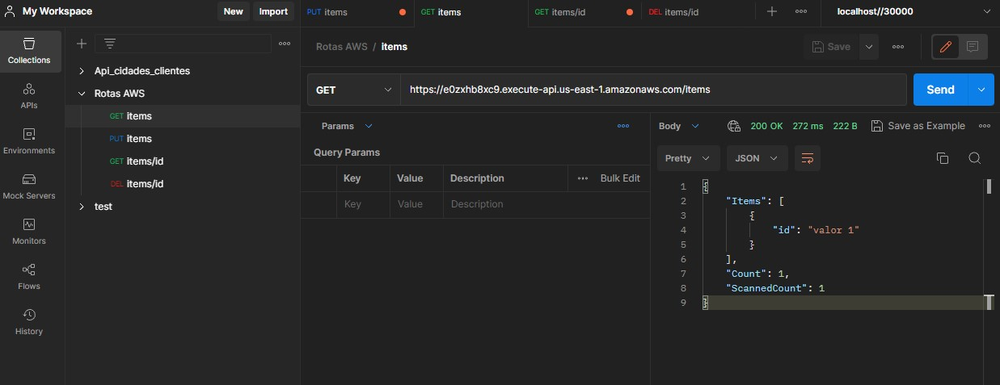
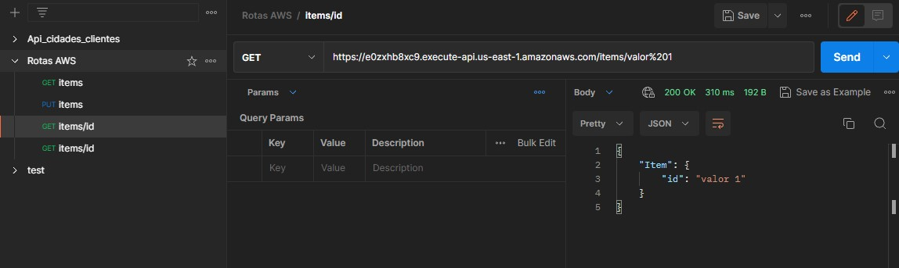
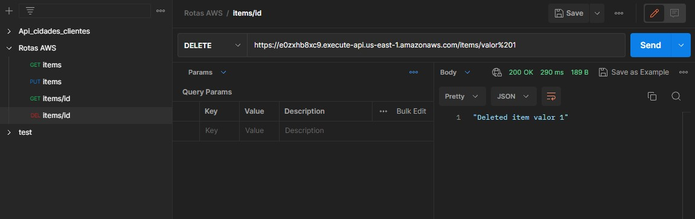
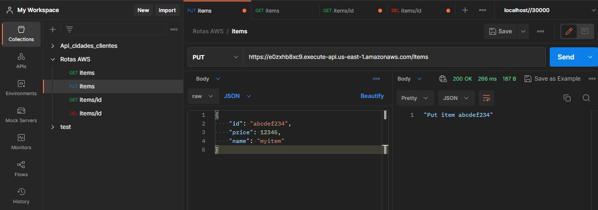

# Criar um Banco de dados no DynamoDB
Objetivo criar um CRUD na AWS.

- Abrir o  DynamoDB console at https://console.aws.amazon.com/dynamodb/
- Clicar em Create table
- Nome da tabela: http-crud-tutorial-items
- Primary key: id

# Criar um Lambda Function

- Abrir o Lambda console at https://console.aws.amazon.com/lambda/
- Clicar em Create function
- Criar função do zero
- Function name: http-crud-tutorial
- Runtime: Node.js 14.x
- Role: http-crud-tutorial-role (Simple microservice permissions)
- Substituir oque está no arquivo index.js por:
```javascript
/*
Copyright 2021 Amazon.com, Inc. or its affiliates. All Rights Reserved.

Permission is hereby granted, free of charge, to any person obtaining a copy of this software and associated documentation files (the "Software"), to deal in the Software without restriction, including without limitation the rights to use, copy, modify, merge, publish, distribute, sublicense, and/or sell copies of the Software, and to permit persons to whom the Software is furnished to do so.

THE SOFTWARE IS PROVIDED "AS IS", WITHOUT WARRANTY OF ANY KIND, EXPRESS OR IMPLIED, INCLUDING BUT NOT LIMITED TO THE WARRANTIES OF MERCHANTABILITY, FITNESS FOR A PARTICULAR PURPOSE AND NONINFRINGEMENT. IN NO EVENT SHALL THE AUTHORS OR COPYRIGHT HOLDERS BE LIABLE FOR ANY CLAIM, DAMAGES OR OTHER LIABILITY, WHETHER IN AN ACTION OF CONTRACT, TORT OR OTHERWISE, ARISING FROM, OUT OF OR IN CONNECTION WITH THE SOFTWARE OR THE USE OR OTHER DEALINGS IN THE SOFTWARE.
 */
const AWS = require("aws-sdk");

const dynamo = new AWS.DynamoDB.DocumentClient();

exports.handler = async (event, context) => {
  let body;
  let statusCode = 200;
  const headers = {
    "Content-Type": "application/json"
  };

  try {
    switch (event.routeKey) {
      case "DELETE /items/{id}":
        await dynamo
          .delete({
            TableName: "http-crud-tutorial-items",
            Key: {
              id: event.pathParameters.id
            }
          })
          .promise();
        body = `Deleted item ${event.pathParameters.id}`;
        break;
      case "GET /items/{id}":
        body = await dynamo
          .get({
            TableName: "http-crud-tutorial-items",
            Key: {
              id: event.pathParameters.id
            }
          })
          .promise();
        break;
      case "GET /items":
        body = await dynamo.scan({ TableName: "http-crud-tutorial-items" }).promise();
        break;
      case "PUT /items":
        let requestJSON = JSON.parse(event.body);
        await dynamo
          .put({
            TableName: "http-crud-tutorial-items",
            Item: {
              id: requestJSON.id,
              price: requestJSON.price,
              name: requestJSON.name
            }
          })
          .promise();
        body = `Put item ${requestJSON.id}`;
        break;
      default:
        throw new Error(`Unsupported route: "${event.routeKey}"`);
    }
  } catch (err) {
    statusCode = 400;
    body = err.message;
  } finally {
    body = JSON.stringify(body);
  }

  return {
    statusCode,
    body,
    headers
  };
};
```
# Criar as rotas HTTP

- Abrir o API Gateway console at https://console.aws.amazon.com/apigateway/
- Clicar em Create API
- API name: http-crud-tutorial
- Criar
- Quatro rotas foram criadas

GET /items/{id}

GET /items

PUT /items

DELETE /items/{id}

# Integrar as rotas com o Lambda Function
- Abrir o API Gateway console at https://console.aws.amazon.com/apigateway/
- Clicar em Develop>integrações  - Gerenciar integrações, ai so integrar com a função lambda criada.
- Clicar em Develop>integrações  -  Anexar integrações a rotas
>Deploy API e anexar integrações as rotas.

# Resulta das consultas com métodos GET, POST, PUT e DELETE
o Atualmente o serviço foi excluido.
### API Testada com o Postman
#### GET /items 
https://******.execute-api.us-east-1.amazonaws.com/items

#### GET /items/{id}
https://******.execute-api.us-east-1.amazonaws.com/items/```valor%201```

#### DELETE /items/{id}
https://******.execute-api.us-east-1.amazonaws.com/items/```valor%201```

#### PUT /items
https://******.execute-api.us-east-1.amazonaws.com/items/```valor%201```

```json
body: 
{
    "id": "abcdef234",
    "price": 12345,
    "name": "myitem"
}
```
