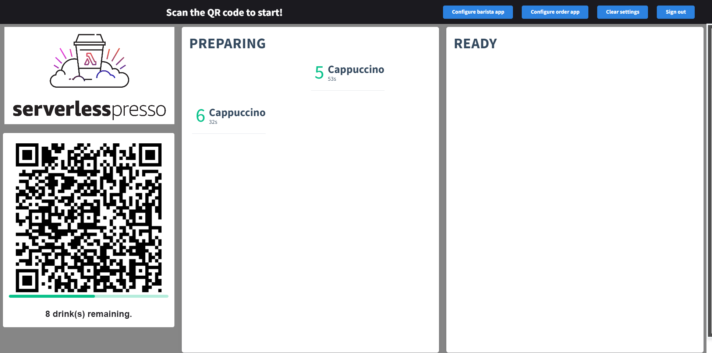

# Parte 1 - Criando um fluxo de Trabalho

- Para criar a aplicação, foi utilizado configurações para pela AWS workshop, O fluxo de Trabalho(workflow) foi utilizando o  da Amazon step functions.

- Order Processor Workflow : é um fluxo de trabalho que é iniciado quando um pedido é colocado, desde do pedido do usuário a sua conclusão a partir deste fluxo e possível chamar outras funções lambda e outros fluxos de trabalho com Order Manager State Machine.
- Order Manager State Machine: é um fluxo de trabalho para gerenciar os pedidos. E acompanha todos os processos que um pedido pode ter a ter ser entrega através deste gerenciador que o pedido e tratado.

# Parte 2 Eventos de Roteamento

- Criado uma nova regra em Amazon EventBridge para chamar um função lambda que armazenar o token criado pelo OrderProcessor que e armazenado em uma tabela no DynamoDB(Itens: serverlesspresso-order-table) através da função chamada do lambda.
- Usando o fluxo de trabalho fornecido do workshop da Amazon, o qual pode fazer 4 tarefas.
    
    >Imagem fornecida pelo workshop da Amazon
    - Colocação do cliente : é quando um cliente envia um pedido de bebida, o fluxo de trabalho limpa esse pedido em relação ao menu atual para garantir que seja uma seleção válida e, em seguida, atualiza a tabela serverlesspresso-order-order com as informações do pedido.
    - Cancelar pedido : esse caminho é usado quando o barista ou o cliente decide cancelar um pedido.
    - Pedido completo : esse caminho é percorrido quando o barista escolhe o botão Concluir no aplicativo barista.
    - Make / Unmake : Este caminho é seguido quando o barista reivindica um pedido do aplicativo barista ou quando o barista move o pedido de volta para o estado de pedido pendente .

- Criado uma nova regra em Amazon EventBridge para Chamar a função do lambda de Aguardar a conclusão do pedido que atualiza o DynamoDB(Itens: serverlesspresso-order-table) com um novo taskToken.

- Teste manual, Iniciou-se o fluxo de trabalho com OrderProcessWorkflow, a partir do evento serverlesspresso simulando o pedido, apos, usou-se o fluxo de trabalho do Gerenciador de Pedidos para simular a entrada do pedido e o barista concluir o pedido.

# Parte 3  - Configurando o Front-End
Objetivo:

- Aplicativo de exibição : exibe o código QR e os pedidos de bebidas futuros/concluídos.

- App Barista : permite que o barista conclua e cancele os pedidos à medida que chegam.

- Aplicativo do cliente : permite que os clientes façam e cancelem pedidos de bebidas.

> obs: O front-end foi fornecido pelo workshop da Amazon, foi feito em vue.js implantados no AWS Amplify.

Os front-ends usam endpoints do Amazon API Gateway e conexão WebSocket com o AWS IoT Core para receber mensagens em tempo real.

- Entrando em cloudFormation e entrando na stack(pilha) do serverless-workshop e entrando na aba Outputs, temos os endpoints para o front-end, faltou somente o host para aplicação o qual foi obtido no CloudShell.

- Entrando com todas as informações necessárias foi possível acessar o front-end do aplicativo e criado um usuário.
- Criado um usuário e preciso da permissão para entrar no aplicativo então foi criado um grupo de usuários com Amazon cognito criado e adicionado um grupo de usuário chamado admin.
- Apos isto foi possível acessar os 3 front-ends, Aplicativo Gerenciador, Aplicação do barista e do usuário.
### Aplicativo Gerenciador de pedidos

### Aplicativo do barista

### Fazendo o pedido

#### Pedido pronto

# Parte 4 - Avançado
> obs: foi fornecido pelo workshop da Amazon os serviços ja configurados e foi preciso so integrar ao sistema com regras.
- Métricas usando AWS eventBridge para acompanhar as métricas dos pedidos e carga de uso das funções e aplicação utilizada.
