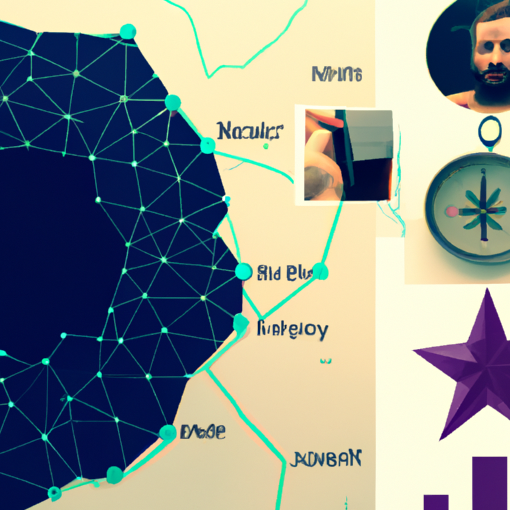

# O que e Hathor

Plataforma de consenso transacional, e um sistema de permite a coordenação e a execução de transações entre os participantes de uma rede, todas blockChains são plataforma de consenso transacional mas nem todas as plataformas de consenso transacional são blockChains.

DAG (Gráfico Acíclico Direcionando), dag são nós interconectados por arestas direcionadas, onde as arestas têm uma direção e não podem formar ciclos fechados, os nos não levam este caminho de volta a si mesmo.

Definição -> plataforma de consenso transacional formada por conceitos de blockchain e DAG, tenta propor um solução de escalabilidade em redes públicas, sem perder a segurança e a descentralização.

## Principais Características

- As transações são armazenadas diretamente no DAG, sem a necessidade de blocos.

- Alta escalabilidade.

- Fácil de usar.

- Não possui taxas.

- Transições "instantâneas"

- Não possui limitação de transações por segundo, limitadas pelo tamanho do bloco.

## Características da rede

- Full node -> Copia local da BlockChain

- Headless Wallet -> Gera tokens não fungíveis, e possui um interface simples para executar transações.(Utilizado o full Node)

- Hathor Wallet -> Interface gráfica para executar as funcionalidade da Hathor Network, de maneira simplificada.

## Demonstração Hathor Wallet e Hathor Headless Wallet

- [Hathor Wallet](https://hathor.network/)

- Baixar a Hathor Wallet, e executar o arquivo.
- Selecionar como Software wallet.(a HardWallet é para carteiras de dispositivos físicos)
- Nova Carteira e Criar palavra chave.
- Senha para acessar a carteira & PIN de 6 dígitos.

  > obs: Nesta demostração usamos a rede de teste

- Para utilizar a rede de teste, é necessário ir em configurações e configurar a rede de teste.

- Para criar tokens não fungíveis(NFTs), e necessário ter HTR na carteira, para pagar a taxa de criação do NFT, a taxa e de 1% do valor do NFT, exemplo: 1.000.000 de NFTs, o valor da taxa e de 10.000 HTR.

- Da para dar melt em NFTs, ou seja, transformar novamente em HTR.

- [explorer hathor](https://explorer.hathor.network/), Explorer da rede Hathor para visualizar os blocos e as transações anexadas aos blocos.

- [Hathor Headless Wallet](https://wallet-headless.docs.hathor.network/), ver as funcionalidade e chamadas de API disponíveis.

## Projeto Prático Lições

- Da para rodar uma wallet headless localmente com docker e um node próprio ou o publico.
- Chamadas de API para rede Hathor Network.
- Chamada de API e geração de imagens com OpenAI API como deve ser a chamada e funciona a estrutura e a resposta da API.
- Chamada de API com a rede infura IPFS, o funcionamento de uma rede IPFS.
- Chamada de API com a rede Hathor Network, funcionamento da rede Hathor e como funcionar a geração de NFT na Hathor.

[Link para o Projeto Prático Repositório](https://github.com/gabrielmissio/webinar-hathor-network)

### Descrição do projeto pratico

- Criar NFTs, com inteligencia artificial baseada nas descrições da NFTs, que gera uma imagem aleatória com esta descrição.

- Token API, que que chama a criação de uma imagem para OpenAI API, que gera uma imagem aleatória com base na descrição, manda esta imagem gerada para INFURA IPFS API para armazenar a imagem na rede IPFS, e retorna o link da imagem gerada, em seguida e criado o NFT com as características paradas para gerar a imagem e o link na rede IPFS para imagem gerada na Rede Hathor Network.

Imagem gerada no WebNar,
<div style="display: flex; ">


```json
{
"file":"ipfs://ipfs/QmPZhWeFPb8MxQrovn2CiV8fooZCpWwLxBauYciL9hxySN",
"name":"Webinar Hathor Network - Cleiton",
"description":"Webinar Hathor Network. Blockchain + 
directed acyclic graph + Hathor + Compass + POV + point of view",
 "attributes":[
    {"type":"webinar","value":"hathor network"},
    {"type":"nome","value":"Cleiton"}
 ]
 }
```


</div>


